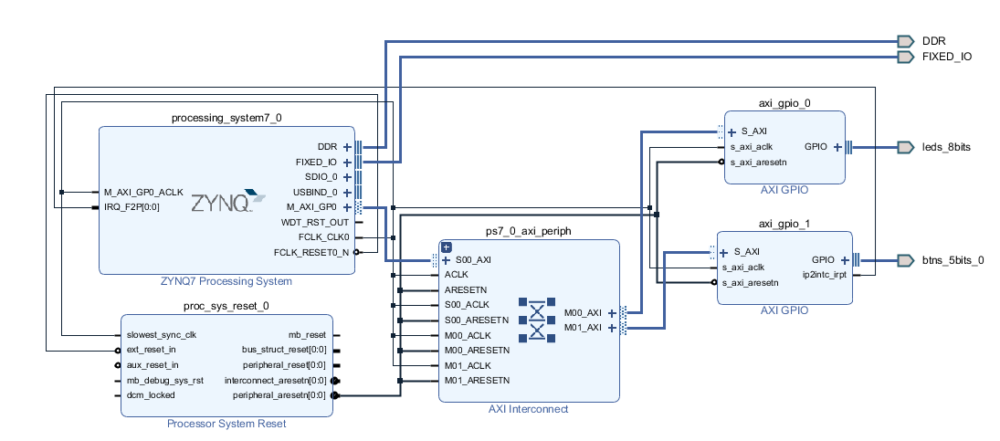

# Zynq-AXI-GPIO-LED-Blinking

## 專案簡介

本專案為 ZYNQ SoC 平台上 HW2 作業，目標為透過 **FPGA GPIO 與外部開關 (SW)** 作為中斷來源，驅動中斷機制並由 Processing System (PS) 處理，實作 GPIO 控制與 LED 顯示。內容包含硬體設計（Vivado）、軟體撰寫（Vitis）、中斷控制與 LED 顯示功能。

## 系統架構



## 需求分析
#### 硬體需求

| 項目             | 說明 |
|------------------|------|
| **開發板**       | EGO-XZ7 Board (Zynq-7000 SoC，型號：XC7Z020CLG484-1) |
| **可程式邏輯 (PL)** | 用來整合 AXI GPIO IP，控制外部 8 顆 LED |
| **LED 燈**       | 8 顆（與 AXI GPIO 輸出腳位相連） |
| 使用 FPGA 硬體觸發中斷   | 使用 AXI GPIO 模組（接收 SW）       |
| 使用外部 SW 作為輸入來源 | 開關連接至 `axi_gpio_1`，觸發中斷          |
| 使用中斷控制器 (GIC)     | `XScuGic` 控制中斷，處理 IRQ 註冊與清除    |
| 驅動設計與 SDK 撰寫     | 使用 Vitis 撰寫中斷驅動與 LED 控制邏輯     |

#### 軟體需求

| 軟體工具      | 說明 |
|---------------|------|
| **Xilinx Vivado** | 建立硬體架構（Block Design）、產生 bitstream 與 XSA 檔案 |


## 主要元件：

- `processing_system7_0`：Zynq PS，包含 ARM CPU。
- `axi_gpio_0`：AXI GPIO IP，用來控制 LED。
- `ps7_0_axi_periph`：AXI Interconnect，連接 PS 和 GPIO。
- `rst_ps7_0_50M`：Reset 模組。
- `leds_8bits`：輸出腳位，連接到實體 LED。

## 中斷註冊與啟用

```c
XScuGic_Connect(&INTCInst, INTC_GPIO_ID, (Xil_ExceptionHandler)Intr_Handler, &BTN);
XScuGic_Enable(&INTCInst, INTC_GPIO_ID);

XGpio_InterruptGlobalEnable(&BTN);
XGpio_InterruptEnable(&BTN, BTN_INT);
```

---

## DEMO
https://youtube.com/shorts/a-uq2wuR8jI?feature=share